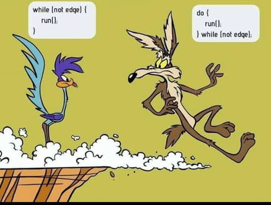

# 제어문(control flow statement)

## 블록문(block statement/compound statement)

- 하나의 실행 단위로 취급한다.
- 문의 종료를 의미하는 자체 종결성을 갖기 때문에 블록문 끝에는 세미콜론(;)을 붙이지 않는다.

## 조건문(conditional statement)

- `if` ... `else` 문

  ```javascript
  if (조건식 1) {
    // 조건식 1 true
  } else if (조건식 2) {
    // 조건식 2 true
  } else {
    // 조건식 1, 조건식 2 false
  }

  ```

- `switch`문

  ```javascript
  switch (표현식) {
    case 표현식 1:
      switch // 표현식 == 표현식 1;
      break;
    case 표현식 2:
      switch // 표현식 == 표현식 2
      break;
    case 표현식 3:
      switch // 표현식 == 표현식 3;
      break;
    default:
      switch // 표현식과 일치하는 case문이 없을 때 실행;
  }
  ```

## 반복문(loop statement)



- `forEach`: 배열 순회
- `for` ... `in` 문: 객체의 프로퍼티 열거
- `for` ... `of` 문: 이터러블 순회(ES6)

## break 문

- 레이블 문, 반복문, switch 문의 코드 블록 외에 break 문 사용하면 SyntaxError(문법 에러)가 발생한다.

  > 레이블 문(label statement)? 식별자가 붙은 문

## continue 문

- 반복문의 코드 블록 실행을 현 지점에서 중단하고 반복문의 증감식으로 실행 흐름을 이동시킨다.
- break 문처럼 반복문을 탈출하지는 않는다.
